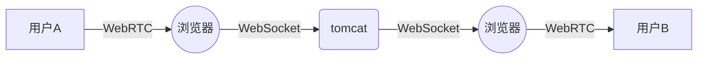

#  WebRTC H5页面 实现服务器转发的视频聊天

原理：[WebRTC H5实现服务器转发的视频聊天](https://blog.csdn.net/Cceking/article/details/80297249)

### 流程

流程如下

1. 用户A 访问页面，浏览器通过 WebRTC API 从摄像头读取数据。
2. 在A的浏览器中，流数据转换为字节数据，通过 WebSocket 发送到运行在 tomcat 的后台程序。
3. 后台程序缓存视频数据。
4. 用户B 访问页面。
5. 后台程序从缓存中取出字节数据，通过 WebSocket 分发到用户B的浏览器。
6. 用户B的浏览器，接收到字节数据，通过 WebRTC API 将字节数据转为视频流，在页面播放。

测试环境
Java 8
Chrome 81.0.4044.122